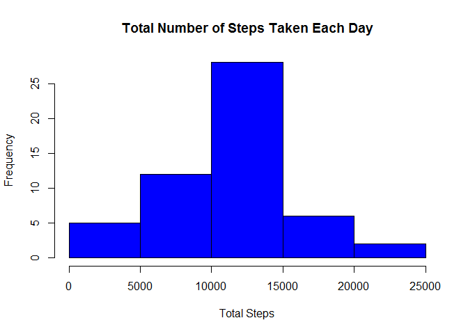
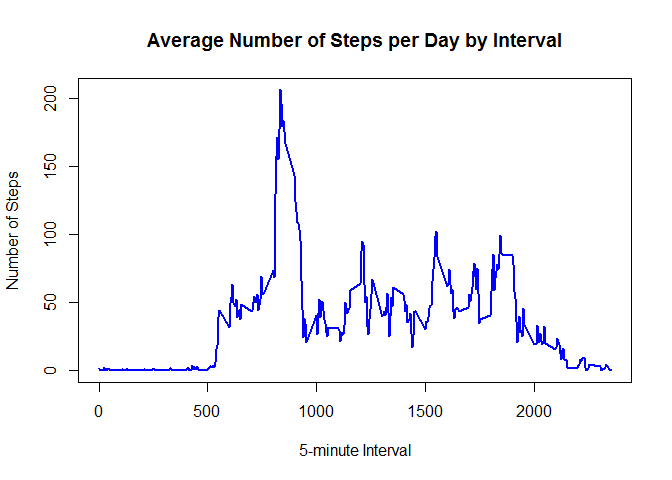
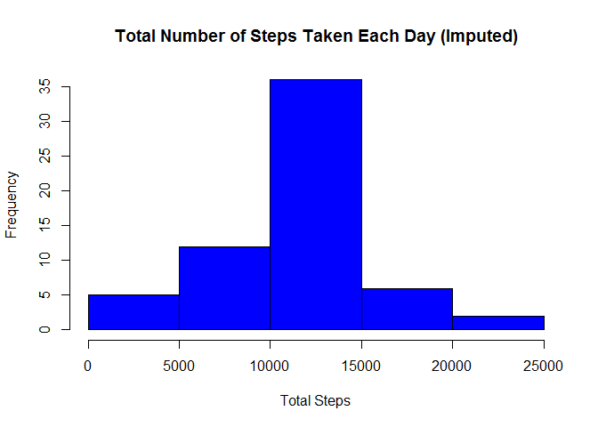
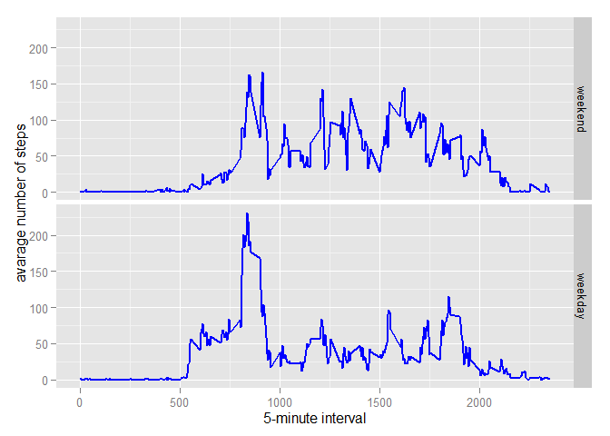

# Reproducible Research: Peer Assessment 1


## Loading and preprocessing the data


####  The loading process begins with loading all the required libraries:  
 

```r
library(data.table)
library(ggplot2)
```


#### 1. Load the data (i.e. read.csv()) 
#### 2. Process/transform the data (if necessary) into a format suitable for your analysis

```r
if(!file.exists('activity.csv'))
{
        unzip('activity.zip')
}

# load the csv data
dtActivity<-fread("activity.csv")
```


## What is mean total number of steps taken per day?

#### 1. Calculate the total number of steps taken per day

```r
# generate dtActivity2 with complete cases only
dtActivity2 <- na.omit(dtActivity)

# aggregate steps as per date to get total number of steps in a day
dtStepsByDay <- aggregate(steps ~ date, dtActivity2, sum)
```

#### 2. Make a histogram of the total number of steps taken each day

```r
# create histogram of total number of setps in a day
hist(dtStepsByDay$steps,
     right=FALSE,
     col="blue", 
     col.main="black",
     col.lab="black", 
     xlab="Total Steps",
     main="Total Number of Steps Taken Each Day")
```

 
     
#### 3. Calculate and report the mean and median of the total number of steps taken per day

```r
# get the mean and median total number of steps per day
meanStepsOfDay <- mean(dtStepsByDay$steps)
medianStepsOfDay <- median(dtStepsByDay$steps)
```
Mean of the total number of steps taken per day: **10766**   
Median of the total number of steps taken per day: **10765**  

## What is the average daily activity pattern?

#### 1.Make a time series plot (i.e. type = "l") of the 5-minute interval (x-axis) and the average number of steps taken, averaged across all days (y-axis)

```r
# aggregate steps as interval to get average number of steps in an interval across all days
stepsByInterval <- aggregate(steps ~ interval, dtActivity2, mean)

# generate the line plot
plot(stepsByInterval$interval, stepsByInterval$steps, 
     col="blue", col.main="black", col.lab="black", lwd=2, type="l", 
     xlab="5-minute Interval", ylab="Number of Steps",
     main="Average Number of Steps per Day by Interval")
```

 
     
#### 2.Which 5-minute interval, on average across all the days in the dataset, contains the maximum number of steps?

```r
# get the interval with maximum average number of steps in an interval
intervalWithMaxStep <- stepsByInterval[which.max(stepsByInterval$steps),1]
```

The 5-minute interval that have maximum number of steps on average across all the days is: **835**  

## Imputing missing values

#### 1.Calculate and report the total number of missing values in the dataset (i.e. the total number of rows with NAs)

```r
# get number of rows with NA's
missingValues <- length(which(is.na(dtActivity$steps)))
```

Missing Values in dataset: **2304**  

#### 2.Devise a strategy for filling in all of the missing values in the dataset. The strategy does not need to be sophisticated. For example, you could use the mean/median for that day, or the mean for that 5-minute interval, etc.

```r
dtNewActivity <- dtActivity
is_na <- is.na(dtNewActivity$steps)

# use mean to fill in all of the missing values
averageActivity <- tapply(stepsByInterval$steps,stepsByInterval$interval, mean)
```

#### 3.Create a new dataset that is equal to the original dataset but with the missing data filled in.

```r
# new dataset with the missing data filled in
dtNewActivity$steps[is_na] <- averageActivity[as.character(dtNewActivity$interval[is_na])]
```


#### 4.Make a histogram of the total number of steps taken each day and Calculate and report the mean and median total number of steps taken per day. Do these values differ from the estimates from the first part of the assignment? What is the impact of imputing missing data on the estimates of the total daily number of steps?

```r
# aggregate steps as per date to get total number of steps in a day
dailyActivity <- aggregate(steps ~ date, dtNewActivity, sum)

# create histogram of total number of setps in a day
hist(dailyActivity$steps,
     right=FALSE,
     col="blue",
     col.main="black",
     col.lab="black",
     xlab="Total Steps",
     main="Total Number of Steps Taken Each Day (Imputed)")
```

 

```r
# get mean and median of total number of steps per day with imputing missing data
newMeanStepsOfDay <- mean(dailyActivity$steps)
newMedianStepsOfDay <- median(dailyActivity$steps)
```

Mean for the total number of steps taken per day: **10766**  
Median for the total number of steps taken per day: **10766**  

The impact of the missing data seems rather low, at least when estimating the total number of steps per day.

## Are there differences in activity patterns between weekdays and weekends?

#### 1.Create a new factor variable in the dataset with two levels - "weekday" and "weekend" indicating whether a given date is a weekday or weekend day.

```r
# add new factor variable dateType with two levels
weekdays1 <- c('Monday', 'Tuesday', 'Wednesday', 'Thursday', 'Friday')
dtNewActivity$dateType <- factor((weekdays(as.POSIXlt(dtNewActivity$date)) %in% weekdays1), levels=c(FALSE, TRUE), labels=c('weekend', 'weekday')) 
```

#### 2.Make a panel plot containing a time series plot (i.e. type = "l") of the 5-minute interval (x-axis) and the average number of steps taken, averaged across all weekday days or weekend days (y-axis). See the README file in the GitHub repository to see an example of what this plot should look like using simulated data.

```r
# aggregate steps as interval to get average number of steps in an interval across all days
newAaverageAactivity <- aggregate(steps ~ interval + dateType, data=dtNewActivity, mean)

# make the panel plot for weekdays and weekends
ggplot(newAaverageAactivity, aes(interval, steps),color="blue") + 
    geom_line(size=1,colour="blue") + 
    facet_grid(dateType ~ .) +
    xlab("5-minute interval") + 
    ylab("avarage number of steps") +
    theme(axis.title.x = element_text(colour = "black"),
          axis.title.y = element_text(colour = "black"))
```

 


The plot indicates that there are differences in activity between weekends and weekdays. Most people are more active in the weekends.
